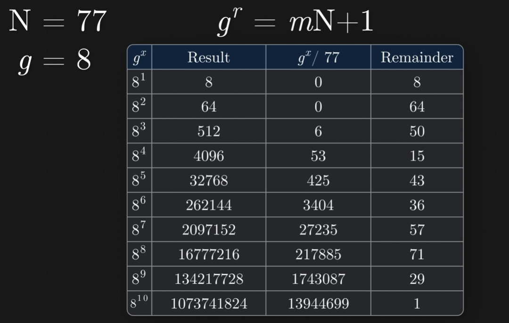
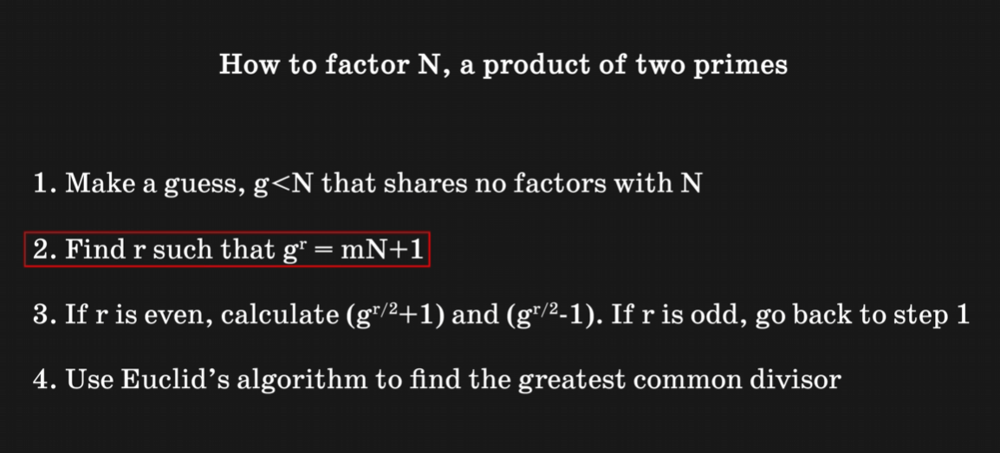
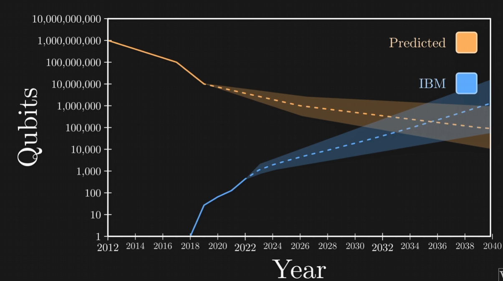

# why?

SNDL - NSA (national security administration) fears that Quantum computers in next 10 years will get powerful enough to break RSA (Ron *R*ivest, Adi *S*hamir, Leonard *A*delman) encryption (no matter the lenght) within minutes hours or days (quickly)

# RSA inner workings

each person has a set of two big prime numbers (private keys) and they multiply these to get a public key. When sending a message to someone, i use their public key in such a way that if they dont know their private keys the message is undecriptable.

Only way to decrypt without knowing private keys is to factor the public key. Size of these private keys is a problem (those keys are enormous - thousands of digits in lenght)

# Quantum computers enter the stage

Quantum computers can simultanously provide answers to $2^n$ problems (where $n$ is number of qubits) (thanks to quantum entanglement).

$2^20 = ~1000000$ answers
$2^300 = 10^90$ answers (more than number of particles in visible universe)

Problem is that quantum entanglement makes these answers unreadable on by one (phisics thing). But patterns will be preserved!!!

> Here **Mr. Szymon Jacon** comes in with explanation of Fourier transformations + Euclids Algorithm (commonly known as Shors Algorithm)

In red is the part of the algo which can be sped up by Quantum computers

# Predicitons on when Q-computers will break RSA encryption

# NIST and Q-computer safe encryption algorithm contest

There where 82 proposals and 4 (3 of them use lattices) where chosen as Q-computer safe algorithms.

# How do these work (lattices - (polski: sieci))?

[Watch this: "How Quantum Computers Break The Internet... Starting Now" - Veritasium](https://www.youtube.com/watch?v=-UrdExQW0cs)
