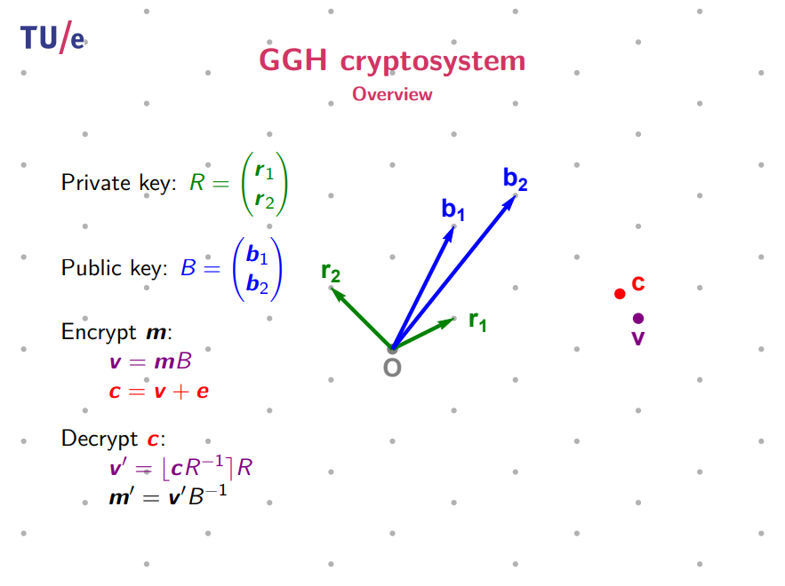
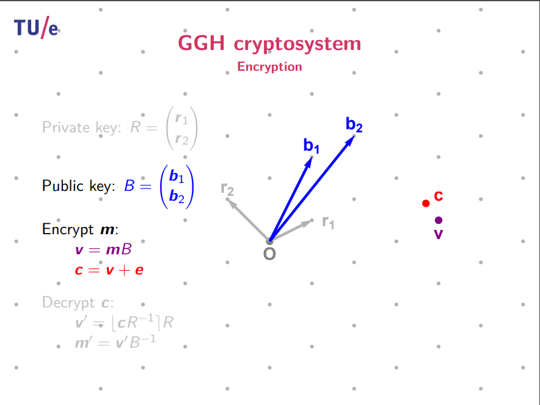
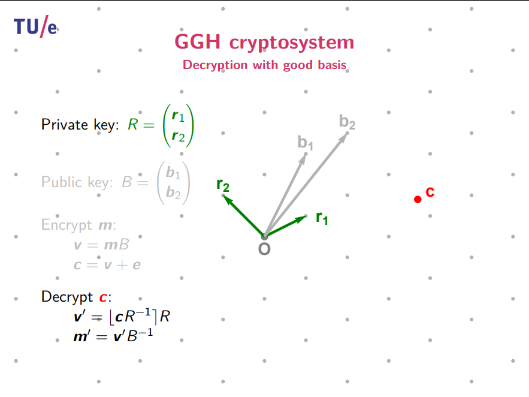

# dlaczego?

SNDL - NSA (National Security Administration) obawia się, że w ciągu najbliższych 10 lat komputery kwantowe staną się na tyle potężne, że będą w stanie złamać szyfrowanie RSA (Ron *R*ivest, Adi *S*hamir, Leonard *A*delman) (niezależnie od długości) w ciągu kilku minut, godzin lub dni (szybko).

# Działanie RSA

Każda osoba posiada zestaw dwóch dużych liczb pierwszych (klucze prywatne) i mnoży je, aby uzyskać klucz publiczny. Wysyłając wiadomość do kogoś, używam jego klucza publicznego w taki sposób, że jeśli nie zna swoich kluczy prywatnych, wiadomość jest nieodczytywalna.

Jedynym sposobem na odszyfrowanie bez znajomości kluczy prywatnych jest faktoryzacja klucza publicznego. Problemem jest rozmiar tych kluczy prywatnych (są ogromne - mają tysiące cyfr długości).

# Komputery kwantowe wchodzą na scenę

Komputery kwantowe mogą jednocześnie dostarczać odpowiedzi na $2^n$ problemów (gdzie $n$ to liczba kubitów) (dzięki splątaniu kwantowemu).

$2^20 = ~1000000$ odpowiedzi
$2^300 = 10^90$ odpowiedzi (więcej niż liczba cząstek we wszechświecie widzialnym)

Problem polega na tym, że splątanie kwantowe sprawia, że te odpowiedzi są nieczytelne pojedynczo (kwestia fizyki). Ale wzorce zostaną zachowane!!!

> Tu **Pan Szymon Jacon** wchodzi z wyjaśnieniem transformacji Fouriera + Algorytmu Euklidesa (znany jako Algorytm Shora)

Na czerwono zaznaczona jest część algorytmu, która może być przyspieszona przez komputery kwantowe.

# Przewidywania kiedy komputery kwantowe złamią szyfrowanie RSA

# NIST i konkurs na algorytm szyfrujący bezpieczny dla komputerów kwantowych

Było 82 propozycji i 4 (3 z nich używają sieci) zostały wybrane jako algorytmy bezpieczne dla komputerów kwantowych.

# Jak działają (sieci, eng: lattice)?

[Obejrzyj to: "How Quantum Computers Break The Internet... Starting Now" - Veritasium](https://www.youtube.com/watch?v=-UrdExQW0cs)

[Źródło na temat algorytmu GGH](https://thijs.com/docs/lec1.pdf)

Kryptosystem Goldreich-Goldwasser-Halevi (GGH) jest systemem kryptograficznym opartym na sieciach, co oznacza, że opiera się na strukturze matematycznej problemów sieciowych dla swojego bezpieczeństwa. Jest to dość różne od bardziej znanych systemów takich jak RSA czy ECC. Oto uproszczone wyjaśnienie, jak to działa:

### Klucz Publiczny

**Konstrukcja**: Klucz publiczny w kryptosystemie GGH to "zła" baza sieci. Zła baza to taka, gdzie wektory są stosunkowo długie i rownoległe, co sprawia, że obliczeniowo trudno jest znaleźć najkrótszy wektor w sieci.
**Użycie**: Ten klucz publiczny jest używany do szyfrowania wiadomości.

### Klucz Prywatny

**Konstrukcja**: Klucz prywatny to "dobra" baza tej samej sieci. Dobra baza składa się z krótkich, prawie prostopadłych wektorów. Ułatwia to wykonywanie pewnych obliczeń na sieci, takich jak znajdowanie najbliższego wektora do danego punktu.
**Użycie**: Klucz prywatny jest używany do odszyfrowywania wiadomości.

### Proces Szyfrowania

**Reprezentacja Wiadomości**: Najpierw wiadomość jest reprezentowana jako punkt w sieci. Zwykle wymaga to pewnej formy kodowania.
**Zaburzenie**: Następnie punkt jest lekko zaburzany. To zaburzenie jest na tyle małe, że przy użyciu dobrej bazy (klucz prywatny) można odzyskać oryginalny punkt, ale na tyle duże, aby odzyskanie było trudne przy złej bazie (klucz publiczny).
**Zastosowanie Klucza Publicznego**: Zaburzony punkt jest następnie transformowany przy użyciu klucza publicznego. Wynik to zaszyfrowana wiadomość.

### Proces Odszyfrowywania

**Zastosowanie Klucza Prywatnego**: Zaszyfrowana wiadomość (punkt w sieci) jest transformowana przy użyciu klucza prywatnego.
**Problem Najbliższego Wektora (CVP)**: Przekształcony punkt jest następnie używany do rozwiązania CVP w sieci zdefiniowanej przez klucz prywatny. Ponieważ klucz prywatny jest dobrą bazą, ten problem jest obliczeniowo wykonalny.
**Odzyskiwanie Oryginalnej Wiadomości**: Rozwiązanie CVP daje oryginalny, niezaburzony punkt, który następnie można zdekodować z powrotem na oryginalną wiadomość.

Na załączonym obrazku przedstawiono notacje i procesy związane z kryptosystemem GGH. Oto wyjaśnienie przedstawionych tam terminów:

- **Klucz prywatny $R$**: Jest to macierz używana jako klucz prywatny w kryptosystemie GGH. Wektory $r_1$ i $r_2$ tworzą bazę dla sieci, która ma dobre właściwości, czyli jest łatwa do analizy przez posiadacza klucza prywatnego.
- **Klucz publiczny $B$**: To macierz, która jest wyprowadzona z klucza prywatnego poprzez dokonanie przekształceń liniowych i dodanie błędu, tak aby utworzyć bazę o złych właściwościach, czyli trudną do analizy dla kogoś, kto nie zna klucza prywatnego. Wektory $b_1$ i $b_2$ są publicznie znane i służą do szyfrowania wiadomości.
- **Wiadomość $m$**: To macierz, przedstawiajaca wiadomosc
- **Zaszyfrowana wiadomość $c$**: to macierz $mB$ przesunieta o $e$
- **Szyfrowanie wiadomości $m$**:
  - $v = mB$: Wiadomość $m$ jest szyfrowana poprzez pomnożenie jej przez klucz publiczny $B$, co daje wektor $v$.
  - $c = v + e$: Do wektora $v$ dodawany jest losowy niewielki błąd $e$, tworząc zaszyfrowaną wiadomość $c$.
- **Deszyfrowanie wiadomości $c$**:
  - $v' = [cR^{-1}]R$: Aby odszyfrować, stosuje się odwrotność klucza prywatnego $R^{-1}$ do zaszyfrowanej wiadomości $c$, a następnie zaokrągla się wynik do najbliższej całkowitej wartości w sieci (reprezentowanej przez $R$). To daje nam wektor $v'$, który jest przybliżeniem oryginalnego wektora $v$ przed dodaniem błędu.
  - $m' = v'B^{-1}$: Następnie stosuje się odwrotność klucza publicznego $B^{-1}$do$v'$, aby odzyskać przybliżoną wiadomość $m'$, która powinna być równa oryginalnej wiadomości $m$ jeśli nie wystąpią żadne błędy w obliczeniach.

Kropki reprezentują punkty w przestrzeni sieci, a $O$ to punkt odniesienia (prawdopodobnie początek układu współrzędnych). Czerwony punkt $C$ to zaszyfrowana wiadomość, a fioletowy punkt $V$ to wektor $v$ przed dodaniem błędu. Proces ten ilustruje, jak klucz prywatny i publiczny są używane do transformacji wektorów w celu szyfrowania i deszyfrowania wiadomości w kontekście sieci lattice.
