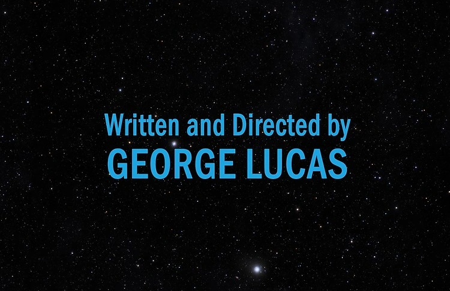

# Szyfrowanie Kwantowe

---

# Co to są kwanty? Co to są kubity?

**Bit** - jest to najmniejsza wartosc informacji w informatyce _klasycznej_. Jej wartoscia moze byc $0$ albo $1$.

**Kubit** - jest to najmniejsza wartosc informacji w unformatyce _kwantowej_. Przyjmuje wartosci miedzy superpozycja $(1, 0)$ a $(0, 1)$ a po zapadnieciu sie stanu kwanowego wartosci te sa $1$ albo $0$. Kubity mozna tez ze soba laczyc poprzez splatanie kwantowe.

---

# Co to superpozycja?

Roznice miedzy bitem a kubitem moznaby wytlumaczyc ponizszym porownaniem:

> To jak kiedy próbujesz się zdecydować, czy chcesz jeść lody truskawkowe czy czekoladowe, i ktoś mówi, że możesz mieć trochę obu na raz. Dzięki temu komputery kwantowe mogą rozwiązywać trudne problemy szybciej niż zwykłe komputery, bo patrzą na wiele możliwości naraz, a nie tylko na jedną.

---

# Co to jest Szyfrowanie Kwantowe?

- Technologia kryptograficzna wykorzystująca mechanikę kwantową
- Zapewnia bezpieczne przechowywanie i przesyłanie informacji

---

# Dlaczego potrzebujemy szyfrowania kwantowego

Potrzebujemy szyfrowania kwantowego, bo jak pojawią się komputery kwantowe to współczesne szyfrowanie będzie useless.

---

---

# Dlaczego potrzebujemy szyfrowania kwantowego

~~Potrzebujemy szyfrowania kwantowego, bo jak pojawią się komputery kwantowe to współczesne szyfrowanie będzie useless.~~

Trochę jest w tym prawdy, ale jest to bardziej złożone niż się wydaje. Ale żeby zrozumieć czemu, musimy wam pokazać czym jest *Algorytm Shora* i czemu jest on game changerem.

---

# Naiwne odgadywanie klucza prywatnego

Najprostszym sposobem łamania klucza prywatnego jest odgadywanie go. Zgadywanie można robić poprzez znajdywania czynników mnożenia klucza publicznego (będących liczbami pierwszymi).

<!-- Czy jest to dobry sposób odpowiedźcie sobie sami xd -->

Ulepszeniem tego sposobu jest skorzystanie z algorytmu Shora, który pozwala nam przekształcić sprawdzanie losowych liczb w sprawdzanie *"lepszych liczb"* <!-- czym jest ta lepsza liczba to wyjaśnię później -->. Ale tutaj pojawia się mały haczyk, bo żeby policzyć taką *"lepszą liczbę"* na klasycznym kąkutrze potrzebujemy tak samo dużo czasu jak bez tego algorytmu.
<!-- i tutaj wkraczają komputery kwantowe -->

---

# Algorytm Shora
<!-- Na czym tak właściwie polega algorytm Shora -->
<!-- Na wejściu algorytmu dostajemy liczbę naturalną $N$ która jest kluczem publicznym. Naszym zadaniem jest znalezienie liczby p -->
<!-- Legenda:
zielony - komputer klasyczny
niebieski - komputer kwantowy -->

1. Jeśli $N$ jest parzyste, albo jest potęgą doskonałą (*ang. Perfect power*) to można zakończyć, ponieważ czynniki są łatwo znajdywalne. W przeciwnym wypadku kontynujemy
2. Wylosować liczbę $g$, taką że $g \in (2, N-1)$
3. Znaleźć najmniejszą dodatnią liczbę całkowitą spełniającą równanie $g^p \equiv 1 \pmod{N}$
4. Sprawdzamy dwie możliwości:
    1. Jeśli $2 \mid p \land g^{\frac{p}{2}} \not \equiv -1 \pmod{N}$ to kontynuj.
    2. Jeśli $2 \not\mid p \lor g^{\frac{p}{2}} \equiv -1 \pmod{N}$, to wróć do kroku 2, wybierając inną losową wartość $g$, aż znajdziesz odpowiednie $p$.
5. Skoro $2 \mid p \land g^{\frac{p}{2}} \not \equiv -1 \pmod{N}$, to czynniki liczby $N$ można znaleźć przy użyciu $NWD(g^{\frac{p}{2}} \pm 1, N)$

---

# Algorytm Shora - deep dive w krok 3

<!-- Tutaj muszę jeszcze opisać na czym polega ten kwantowy krok i powiedzieć mniej więcej czemu jest taki szybki -->
<!-- Więc to jeszcze w trakcie -->

---

# Kluczowe cechy szyfrowania kwantowego:

1. **Superpozycja:** W mechanice kwantowej cząstki mogą istnieć w wielu stanach jednocześnie. To zjawisko, znane jako superpozycja, umożliwia kodowanie znacznie większej ilości informacji na pojedynczym kubicie (podstawowej jednostce informacji kwantowej) w porównaniu z bitami w klasycznym komputerze.

2. **Zasada nieoznaczoności Heisenberga:** Ta zasada mechaniki kwantowej stwierdza, że nie można jednocześnie dokładnie zmierzyć dwóch sprzężonych ze sobą wielkości, takich jak pozycja i pęd. W praktyce oznacza to, że nie można "odsłuchać" komunikacji kwantowej bez zakłócenia przesyłanych danych.

3. **Splątanie kwantowe (entanglement):** To zjawisko pozwala na łączenie kubitów w taki sposób, że zmiana stanu jednego kubitu natychmiast wpływa na stan drugiego, niezależnie od odległości między nimi.

---

# Zastosowania:

- **Kwantowe klucze dystrybucyjne (QKD):** Technika ta umożliwia tworzenie współdzielonych, tajnych kluczy kryptograficznych, które są teoretycznie nie do złamania dzięki zasadom mechaniki kwantowej. QKD jest już wykorzystywane w niektórych zastosowaniach komercyjnych i rządowych do zabezpieczania krytycznej infrastruktury i komunikacji.

- **Bezpieczna komunikacja:** Dzięki technologii QKD możliwe jest bezpieczne przesyłanie informacji pomiędzy stronami, nawet w obliczu rosnącego zagrożenia ze strony komputerów kwantowych, które mogą łamać obecne algorytmy kryptograficzne.

---

# Wyzwania:

- **Zasięg:** Komunikacja kwantowa na dużą skalę jest trudna do realizacji z powodu strat sygnału kwantowego (znanych jako dekoherencja) w kanałach transmisyjnych, takich jak światłowody.

- **Technologia:** Technologia kwantowa jest wciąż w fazie rozwoju, z wieloma wyzwaniami technicznymi i naukowymi do przezwyciężenia.

- **Koszt:** Obecne systemy kwantowe są kosztowne i zazwyczaj wymagają warunków pracy w niskich temperaturach lub próżni, co komplikuje ich wdrożenie na dużą skalę.

---

# Podsumowanie:

Szyfrowanie kwantowe oferuje obiecującą ścieżkę do bezpieczeństwa informacji w erze komputacji kwantowej. Chociaż technologia ta jest wciąż w fazie rozwoju, jej zdolność do zapewnienia bezpieczeństwa komunikacji jest niezrównana w porównaniu z klasyczną kryptografią.

---

# Żródła

[Wikipedia - https://en.wikipedia.org/wiki/Quantum_cryptography](https://en.wikipedia.org/wiki/Quantum_cryptography)

---

# Dziekujemy za uwage :3

- Szymon Jacoń
- Szymon Kaszuba-Gałka
